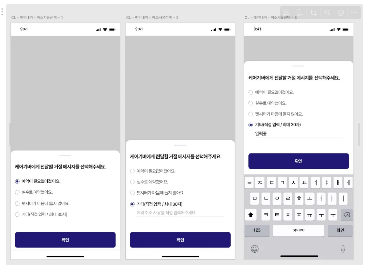
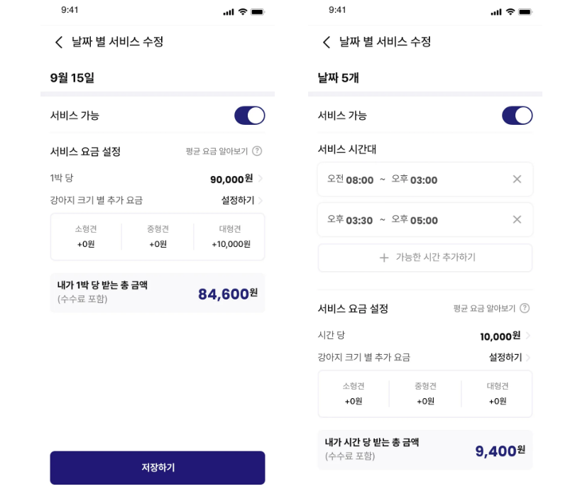
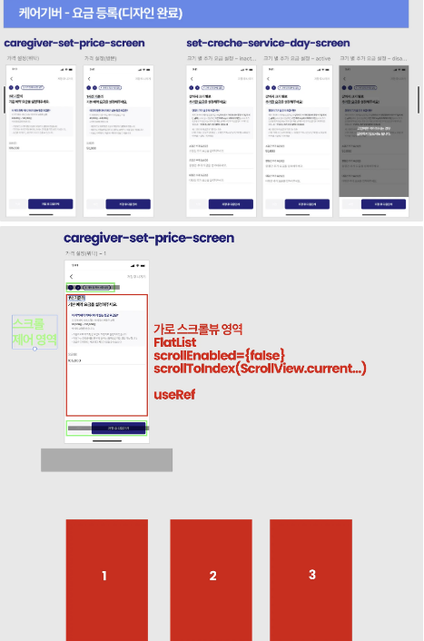

## 케어기버

---

## 📋 프로젝트 개요
**케어기버**는 반려견을 홀로 두고 외출하기 어려운 반려인들을 위한 펫시터 매칭 플랫폼입니다. 누구나 쉽게 펫시터가 될 수 있으며 반려인은 펫시터에게 펫시팅(방문/위탁)을 맡기고 마음 편하게 외출할 수 있습니다.  
**사용자가 상황에 따라 반려인/펫시터 모드를 자유롭게 전환**할 수 있어, 서비스 제공자와 이용자 모두가 될 수 있는 유연한 플랫폼입니다.

## 🔍 주요 특징
- **모드 전환 시스템** : 한 계정으로 반려인과 펫시터 역할을 자유롭게 전환
- **펫시팅 서비스** : 방문 펫시팅과 위탁 펫시팅 서비스 지원
- **펫시터별 맞춤 요금 설정 가능** : 기본 요금과 부가 서비스에 따른 유연한 요금 설정
- **예약 관리 시스템** : 실시간 예약 상태 업데이트, 예약 확정/취소/변경

## 🛠️ 기술 스택
React Native, TypeScript, MobX State Tree, React Query, Styled Components

## 성장 포인트
- MVP 아키텍처를 활용한 대규모 모바일 애플리케이션에서 프론트에드 개발 경험
- 체계적인 코드 컨벤션과 모듈화 환경에서 작업
- 스프린트 단위로 작업하면서 상세한 코드리뷰를 받으면서 개발 역량 강화

## 기여한 내역
1. 결제 스크린 - 서비스 요금 설정 화면(기본 요금, 추가 요금 등)  
  
2. 예약 취소 바텀시트 모달  
   
3. 날짜별 서비스 수정 스크린  
    
4. 요금 등록 컴포넌트 리팩토링  
    

## 📝 프로젝트 회고
React Native 환경에서의 첫 프로젝트로, 웹 개발과는 완전히 다른 개발 환경과 워크플로우로 프로젝트 초기부터 수많은 난관에 부딪혔다. 안드로이드 스튜디오 설치부터 에뮬레이터 및 각종 환경 변수 설정까지 어려움이 많았으며, 특히 에뮬레이터 실행 시 발생하는 다양한 오류들과 내 PC의 성능 이슈로 개발을 시작하는데에도 오랜 시간이 소요되었다. 해외에서 근무 중이라 바쁠텐데도 불구하고 프론트엔드 리더가 원격으로 복잡한 환경변수 설정과 에뮬레이터 설정을 도와주었고 덕분에 개발 환경을 제대로 구축할 수 있었다.  
처음 접한 대규모 프로젝트였기에 프로젝트 구조를 이해하는데만 많은 시간을 투자해야 했다. 다행히 Jira와 Github Issue를 통해 상세하게 작업을 받아 차근차근 도전할 수 있었다.  
특히 기억에 남는 것은 프론트엔드 리더가 구축해 놓은 커스텀 스크립트였다. 컴포넌트/스크린/모델 생성이 자동화되어 있어 처음에는 매우 신기했고, 복잡한 폴더 구조에도 일관된 패턴으로 개발할 수 있었다.  
실제 기능을 구현하기까지 어려움을 하나씩 극복해 나가는 과정에서 큰 성장을 경험했다. 많은 시간과 노력을 투자한 만큼 완성된 기능을 에뮬레레이터에서 확인하면 정말 큰 뿌듯함과 보람을 느낄 수 있었다.  
도움을 아끼지 않은 프론트엔드 리더에게 특히 감사함을 느끼며, 앞으로 나 역시 다른 개발자에게 성심성의껏 도움을 줄 수 있는 개발자가 되고싶다는 목표를 갖게 되었다. 

## 앱 실행 방법
1. yarn install
2. yarn ios 또는 yarn android
3. (Metro 서버가 끊긴경우) yarn start-metro

## 작업 관련 명령어

- 컴포넌트 생성: `yarn component 컴포넌트명`
- 스크린 생성: `yarn screen 스크린명`
- 모델 생성: `yarn model 모델명`

## 기타 명령어

- 캐시 삭제: `yarn c `
